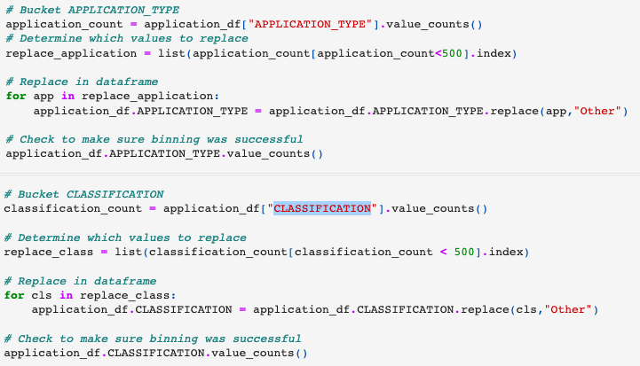

# Neural Network Charity Analysis
## Overview of the Analysis
This analysis uses Machine Learning and Neural Networks to create a binary classifier to predict whether applicants will be successful if funded by Alphabet Soup.

## Results
### Data Preprocessing
- The target variable for the model would be "IS_SUCCESSFUL Column
- Featured columns are "APPLICATION_TYPE, AFFILIATION, CLASSIFICATION, USE_CASE, ORGANIZATION, STATUS, INCOME_AMT, SPECIAL_CONSIDERATIONS, ASK_AMT"
- Removed variables "EIN, NAME"
### Compiling, Training, and Evaluating the Model
- This deep-learning neural network model is made of two hidden layers with 80 and 30 neurons respectively.
The input data has 43 features and 25,724 samples. The first and second hidden layer have the "relu" activation function and the activation function for the output layer is "sigmoid."
- The model could not get a satisfying perfomance with an accuracy under 75%
- It was optimized by bucketing the "APPlication_TYPE, CLASSIFICATION" columns

## Summary
Summarize the overall results of the deep learning model. Include a recommendation for how a different model could solve this classification problem, and explain your recommendation.
After optimizing the model the accuary went up only one percent and the loss went down two percent. That leaves the results with still being under the target accuaracy of 75%.
I'd recommend using the Random Forest Classifier to be able to create and combine multiple decision trees. With the amount of estimators this model will be able to make it would cause an increase in the overall accuarcy.
